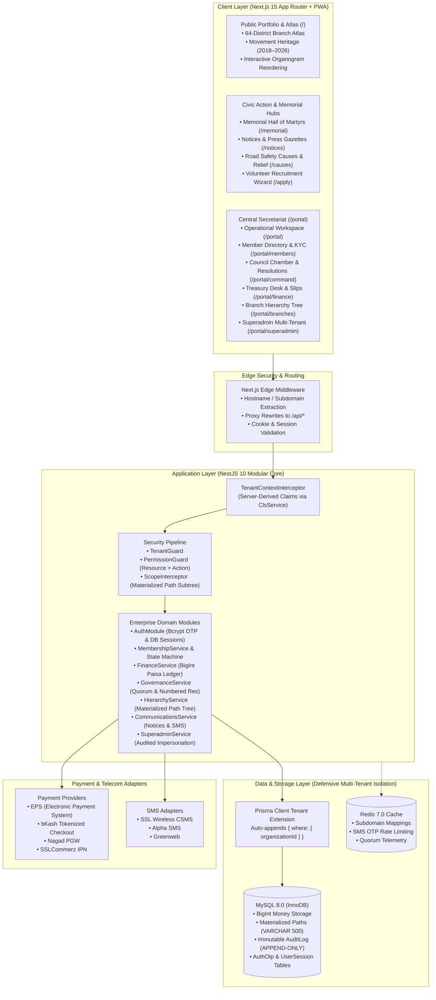

# Organization Operating System (ORG OS)

## Flagship Multi-Tenant SaaS for Institutional Bodies, Civic Movements & Professional Syndicates
### Reference Implementation: **Road Safety Movement (নিরাপদ সড়ক আন্দোলন)** — [roadsafetymovement.org](https://www.roadsafetymovement.org/)


[](https://devcenterpoint.com)

**A sovereign, high-trust digital platform engineered to represent the prestige of premier organizations with zero AI slop, zero futuristic cyber clutter, and maximum institutional dignity.**

*Architected & Engineered by [DevCenterPoint](https://devcenterpoint.com)*

[Live Architecture](#system-architecture) • [Feature Showcase](#core-capabilities) • [64-District Atlas](#1-precise-64-district-interactive-national-atlas-of-bangladesh) • [Drag-and-Drop Organogram](#2-interactive-drag-and-drop-organogram-reordering) • [Quick Start](#quick-start-guide) • [Security Invariants](#security--tenancy-invariants) • [Verification](#quality-gates--testing)

---

## Executive Overview

The **Organization Operating System (ORG OS)** is a sovereign, enterprise-grade multi-tenant platform built for institutional syndicates, civic movements, professional associations, and foundations. 

Our flagship reference tenant is the **Road Safety Movement (নিরাপদ সড়ক আন্দোলন)**—Bangladesh's apex volunteer-driven organization founded during the historic 2018 Students' Movement, mobilizing **9,010+ registered volunteers**, **82 active district/campus committees**, and tracking **420+ monitored highway blackspots** across all 64 districts.

Unlike generic corporate CRMs or fragile website builders, ORG OS delivers **100% visibility in both Light and Dark modes**, strict institutional typography, and an **uncompromising engineering core**:

- **4-Layer Tenant Isolation**: Defensive software tenancy filtering enforced via verified JWT claims, Edge routing, AsyncLocalStorage execution context, and Prisma Client query extensions (strictly ignoring spoofable client headers).
- **Production Authentication & Session Management**: Real cryptographic bcrypt-hashed OTP verification, 60-second dispatch cooldown, 3-attempt lockout defense, and database-backed revocable sessions with `HttpOnly; Secure; SameSite=Strict` cookies.
- **Integer Paisa Financial Ledger**: 100% floating-point-free arithmetic (`BigInt` paisa: `1 BDT = 100 paisa`) with multi-gateway abstraction (EPS, bKash, Nagad, SSLCommerz) and bank slip manual verification queue.
- **Societies Registration Act XXI of 1860 Compliance**: Automated generation of statutory member registers, AGM voting rolls, and numbered legal resolutions.
- **Geographically Precise 64-District National Atlas**: Official BBS/OCHA administrative MultiPolygon boundaries with authentic National Green and Adaptive Theme rendering.
- **Council Admin Drag-and-Drop Organogram**: Dynamic rank precedence reordering with audio synthesis feedback.

---

## System Architecture



---

## Core Capabilities

### 1. Precise 64-District Interactive National Atlas of Bangladesh

Located at `apps/web/src/components/geo/bangladesh-branch-atlas.tsx`:
- **Real BBS/OCHA Administrative MultiPolygons**: Built from authentic district vector coordinates (`bangladesh-districts-geo.json`), accurately tracing all coastal estuaries, island deltas (Bhola, Hatiya, Sandwip), river confluences, and international borders across all 64 districts.
- **National Green Map Mode**: Matches the authentic green cartography of Bangladesh with lush green district fills (`#22c55e`), deep forest green background (`#05572e`), and crisp district borders.
- **Adaptive Theme Map Mode**: Allows council admins to toggle into high-contrast theme-adaptive view for light or dark modes.
- **Full District Labeling**: Every single district features its name label printed in clean, crisp, legible white text right inside the district boundaries.
- **Live Safety Dossier**: Clicking any district reveals registered volunteer counts, active committees, monitored highway blackspots, campus chapters (BUET, DU, RU, CU, etc.), active safety initiatives, and direct coordinator contact info with call triggers.
- **Division Filtering & Search**: Instant filtering across all 8 divisions and real-time bilingual search.

### 2. Interactive Drag-and-Drop Organogram Reordering

Located at `apps/web/src/components/governance/interactive-organogram.tsx`:
- Executive standing councils:
  1. *Central Executive Secretariat*
  2. *Policy Advocacy & Transport Law Reform Wing*
  3. *Crash Research, Blackspot Mapping & Data Cell*
  4. *Victim Relief & Legal Rehabilitation Fund*
  5. *Campus Chapters & Youth Action Directorate*
  6. *Driver Education & Defensive Road Academy*
  7. *Public Media, Press & Campaign Directorate*
- **Drag-and-Drop Capability**: Council admins can toggle "Council Admin: Reorder Ranks" and visually drag committee cards vertically to adjust institutional rank precedence.
- Automatic rank recalculation (`#1`, `#2`, etc.) with drop target highlight animations, haptic chime audio feedback, and instant ratification toasts.

### 3. Dynamic Live Theme Swapping in DOM

- Connected in `apps/web/src/components/providers/theme-provider.tsx` and `apps/web/src/app/portal/cms/page.tsx`.
- Color pickers bind directly to `setBrandColors` in the ThemeProvider, updating CSS custom properties (`--primary`, `--ring`, `--accent`) in real-time across the document without page reloads.

### 4. Subtle Web Audio API Haptic & Sound Accents

- Located at `apps/web/src/lib/audio-effects.ts`.
- Zero external audio files or bandwidth overhead. Synthesizes frequency pulses via native Web Audio API oscillators:
  - Soft click for tab switching and navigation.
  - Dual harmonic chime for ratification and resolution approval.
  - Resonant chord for organogram drag-and-drop placement.
  - Mute/Unmute toggle integrated into the 24/7 Safety Desk accessibility dock.

### 5. Civic Memorial & Humanitarian Causes

- **Victim Memorial Hall ("স্মৃতি চিরন্তন")** (`/memorial`): Dedicated sanctuary honoring road crash victims and movement martyrs (Diya Khanam Mim, Abdul Karim Rajib, filmmaker Tareque Masud, cinematographer Mishuk Munier, and Abrar Ahmed).
- **Action Causes & Relief Fund** (`/causes`): 420 Blackspot Elimination, Victim Medical Aid, School Safety Zones, and Commercial Driver Training with live donation modals and receipt vouchers.

### 6. Official Digital Volunteer Pass

- Tamper-evident identity card with verified QR authentication tokens, national typography, official crest seal, and 300 DPI vector CR80 printing specifications.

---

## Complete Frontend Route Catalog (All 30 Routes)

### Public & Civic Portfolio
1. `/` — Institutional Hero, 64-District Atlas, Movement Heritage Timeline (2018–2026), Executive Organogram, Core Pillars.
2. `/apply` — 4-Step Public Volunteer Recruitment & Membership Application Wizard.
3. `/events` — Road Safety Rallies, Workshops, and Defensive Driving Symposiums.
4. `/events/[id]` — Dynamic Event Details, Hour-by-Hour Agenda, Speaker Rosters.
5. `/notices` — Official Gazette & Press Release Vault with bilingual search and memo references.
6. `/notices/[id]` — Dynamic Gazette Memo Reader with printable letterhead.
7. `/causes` — 420 Blackspot Elimination & Victim Relief Funds with instant vouchers.
8. `/gallery` — Photographic Media Archive & Press Lightbox.
9. `/journal` — Road Safety Research Publications & Crash Data Repository.
10. `/memorial` — Road Crash Victims & Movement Martyrs Memorial Hall ("স্মৃতি চিরন্তন").
11. `/verify/member/[id]` — Public Volunteer Pass Verification with cryptographic SHA-256 seal.
12. `/verify/cert/[id]` — Public Training & Good Standing Credential Verification.
13. `/login` — Unified Mobile OTP (+880) & Email/Password Sign-In.
14. `/design-system` — Living Design System & Bengali Typographic Conjunct QA Lab.

### Member & Executive Operational Portal
15. `/portal` — Central Secretariat Module Hub (Routing to all 12 subsystems).
16. `/portal/cms` — Visual Portfolio CMS & Brand Studio with real-time DOM theme swapping.
17. `/portal/concierge` — Fast-Track Member Concierge Desk (Good Standing, Tax Rebate, Helpline).
18. `/portal/members` — Member Directory with live 3-tier privacy enforcement (Public / Member / Executive).
19. `/portal/branches` — Interactive Visual Branch Tree Explorer with materialized path telemetry.
20. `/portal/command` — Executive Command War Room with live velocity ticker and Daily Briefing Card.
21. `/portal/command/resolutions` — Statutory Meeting Minutes & Numbered Resolution Compiler.
22. `/portal/finance` — Treasurer Financial Command Portal with bank slip verification queue & digital money receipts.
23. `/portal/eligibility` — Member Eligibility Dashboard & Tier Progression tracker.
24. `/portal/communications` — Multi-Vendor SMS & Emergency Broadcast Console with handset simulator.
25. `/portal/blood-bank` — Community Blood Donor Network & Emergency Appeal Dispatcher.
26. `/portal/events/checkin` — Gate Steward QR Scanner with attendance logging and coupon issuance.
27. `/portal/lms` — Defensive Driving & Road Law Academy courses & digital certificate issuer.
28. `/portal/reports` — Statutory Government Audit & Societies Registration Act XXI of 1860 export console.
29. `/portal/superadmin` — SaaS Master Control Panel with white-glove 3-step onboarding wizard.
30. `/_not-found` — Branded 404 handler with return navigation.

---

## Quick Start Guide

### Prerequisites
- Node.js 20+
- pnpm 9+
- Docker & Docker Compose (for MySQL 8.0 and Redis 7.0)

### 1. Repository Setup
```bash
git clone https://github.com/beingmushfiq/ORG-Management-System.git
cd "ORG Management System"
pnpm install
```

### 2. Environment Configuration
```bash
cp .env.example .env
```

### 3. Infrastructure Containers
```bash
docker-compose up -d
```

### 4. Database Migration & Road Safety Movement Seeding
```bash
# Push schema migrations
pnpm --filter @org/database prisma db push

# Seed with Road Safety Movement reference data
pnpm --filter @org/database db:seed
```

### 5. Launch Development Servers
```bash
pnpm dev
```
- Web Application: `http://localhost:3000`
- API Service: `http://localhost:4000`

---

## Quality Gates & Testing

### TypeScript Verification
```bash
pnpm typecheck
```
*Enforces 0 type errors across all packages under strict mode.*

### Production Build
```bash
pnpm build
```
*Validates NestJS compilation, Prisma client generation, and Next.js 15 App Router static optimization across all 30 routes.*

---

## Security & Tenancy Invariants

1. **Defensive Software Tenancy**:
   - Software-level multi-tenancy verified via token claims and execution context.
   - Headers like `x-tenant-id` are strictly ignored if unverified.
2. **Deterministic Ledger**:
   - All dues, donations, and payouts are calculated in integer paisa (`BigInt`).
   - Floats are prohibited in financial pathways to eliminate rounding drift.
3. **Data Integrity**:
   - Materialized path tree mutations run inside isolated Prisma transactions with cycle detection.
   - All position changes and resolutions generate immutable, tamper-evident audit trails.

---

## Engineering & Architecture Attribution

**Organization Operating System (ORG OS)** is architected, engineered, and maintained by **[DevCenterPoint](https://devcenterpoint.com)**.

*For institutional onboarding, customized enterprise deployments, or government syndicate migrations, visit [devcenterpoint.com](https://devcenterpoint.com).*
