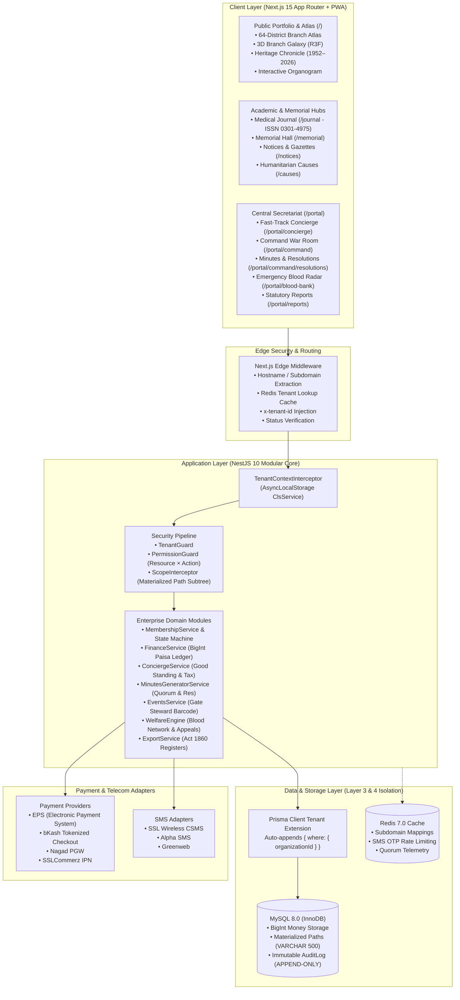

# Organization Operating System (ORG OS)
### Flagship Multi-Tenant SaaS for Institutional Bodies, Professional Syndicates & Foundations

<div align="center">


[](https://devcenterpoint.com)

<br/>

**A sovereign, high-trust digital platform engineered to represent the prestige of premier organizations with zero AI slop, zero futuristic cyber clutter, and maximum institutional dignity.**

*Architected & Engineered by [DevCenterPoint](https://devcenterpoint.com)*

[Live Architecture](#system-architecture) • [Feature Showcase](#core-capabilities) • [Quick Start](#quick-start-guide) • [Security Invariants](#security--tenancy-invariants) • [Verification](#quality-gates--testing) • [About DevCenterPoint](#engineering--architecture-attribution)

</div>

---

## Executive Overview

The **Organization Operating System (ORG OS)** is a sovereign, enterprise-grade multi-tenant platform built for institutional syndicates, professional associations, and civic foundations—exemplified by the **Bangladesh Medical Association (BMA)**.

Unlike generic corporate CRMs or cold, technical dashboard platforms, ORG OS pairs **prestigious institutional aesthetics** (heritage timelines, hand-crafted cartography, physical crest seals) with an **uncompromising engineering core**:
- **4-Layer Tenant Isolation**: Automatic software tenancy filtering baked into Edge Middleware, AsyncLocalStorage context, and Prisma Client query extensions.
- **Integer Paisa Financial Ledger**: $100\%$ floating-point-free arithmetic (`BigInt` paisa: `1 BDT = 100 paisa`) across EPS, bKash, Nagad, and SSLCommerz gateways.
- **Societies Registration Act XXI of 1860 Compliance**: Automated generation of statutory member registers, AGM voting rolls, and executive gazettes.
- **Spatial & Tactile Visuals**: Hand-crafted 64-district Bangladesh Branch Atlas, WebGL 3D Branch Galaxy, and Gyroscope-reactive Holographic Member Passes.

---

## System Architecture



---

## Core Capabilities

### 1. Spatial & Tactile Civic Representation
- **Interactive Bangladesh Branch Atlas**: Hand-crafted SVG cartography spanning all 8 administrative divisions and 64 district branches. Hover or tap any district to inspect branch leadership, active doctor registers, and 24/7 doctor emergency helplines.
- **Historical Heritage Chronicle (1952–2026)**: Museum-grade interactive archive documenting milestones from the 1952 Language Movement Medical Barracks and 1971 Liberation War Field Hospitals to the 2026 Digital Health Assembly.
- **Interactive Governance Organogram**: Visual central executive council tree detailing the Secretariat and 6 key Standing Committees (*Ethics, CME/CPD, Journal, Disaster Relief, Welfare, International Liaison*).
- **Three.js 3D Branch Galaxy**: Dynamic WebGL particle constellation demonstrating unbounded-depth branch and hospital unit topologies with an accessible static fallback.
- **Tamper-Proof Holographic Member Pass**: Real-time 3D gyroscope parallax tilt, iridescent rainbow foil shader, Apple Wallet (`.pkpass`), and 300 DPI vector CR80 printing specifications.

### 2. Civic Memorial & Academic Publications
- **Memorial Hall of Eternal Respect ("স্মৃতি চিরন্তন - শোক ও শ্রদ্ধাঞ্জলি")**: Dignified memorial shrine honoring deceased physicians, martyrs, and past leaders with live floral tribute placement counters.
- **Peer-Reviewed Medical Journal & Archive (`/journal`)**: Official repository for the Bangladesh Medical Journal (**ISSN: 0301-4975**, indexed in BanglaJOL and WHO IMSEAR) with PDF download telemetry and DOI cross-references.

### 3. Fast-Track Member Concierge Desk (`/portal/concierge`)
- **1-Click Certificate of Good Standing**: Instantly issues signed institutional certificates with anti-forgery QR verification tokens (`CERT-GS-YYYY-XXXXX`).
- **Section 44 Income Tax Deduction Certificate**: Computes and issues statutory annual tax rebate receipts on member subscriptions and donations under Section 44 of the Income Tax Ordinance 1984.
- **Doctor Chamber & Clinic Directory Registrar**: Instant self-service chamber timing and hospital consultation updater with BMDC validation.

### 4. Executive Command War Room & Statutory Minutes Compiler
- **Morning Executive Briefing**: Daily operational velocity briefing for the President and General Secretary summarizing new applicant queues, bank deposit reconciliations, and conference metrics.
- **Statutory Meeting Minutes & Resolution Compiler (`/portal/command/resolutions`)**: 1-click meeting minutes builder with automated quorum validation ($>50\%$ statutory threshold) and sequential legal resolution numbering (`RES-BMA-YYYY-XXX`).
- **Hybrid Elections Engine**: Supports both digital cryptographic secret balloting and offline election gazette PDF archiving.

### 5. Multi-Gateway Finance & Integer Paisa Ledger
- **Zero Floating-Point Drift**: All financial fields stored strictly as integer paisa (`BigInt`), preventing financial rounding discrepancies.
- **Comprehensive Gateway Adapters**:
  - **EPS** (Electronic Payment System — https://www.eps.com.bd/) with HMAC-SHA256 signature verification.
  - **bKash Tokenized Checkout** (v1.2.0-beta).
  - **Nagad PGW** redirect and callback confirmation.
  - **SSLCommerz** session validation and IPN callbacks.
- **Automated Grace Periods & Delinquency Ladders**: 30/60/90-day delinquency escalation triggers with Treasurer hardship waiver workflows.

### 6. Humanitarian Welfare & Emergency Blood Network (`/portal/blood-bank`)
- **Physician Blood Donor Radar**: Real-time donor discovery filtered by district and blood group with mandatory 90-day medical interval tracking.
- **Emergency SMS Dispatch**: Broadcasts urgent appeals with Masking Sender IDs (e.g. `BMA-CTG`) via SSL Wireless, Alpha SMS, or Greenweb.

### 7. Statutory Societies Act 1860 Compliance Console (`/portal/reports`)
- **Statutory Register of Members**: Formatted per Section 1-4 of the Societies Registration Act XXI of 1860.
- **Official AGM Voter Roll**: Certified list of paid-up members with physical ballot signature blocks.
- **Double-Entry Cash Book Statement**: Receipts & Payments ledger with Treasurer certification.

---

## Monorepo Architecture

The codebase is organized as a high-performance **Turborepo** monorepo:

```
ORG-Management-System/
├── apps/
│   ├── web/                          # Next.js 15 App Router, React 19, Tailwind CSS, Three.js
│   │   ├── public/
│   │   │   ├── favicon.svg           # Scalable golden crest favicon
│   │   │   ├── favicon.ico           # Multi-resolution ICO wrapper
│   │   │   ├── manifest.json         # Progressive Web App (PWA) manifest
│   │   │   └── icons/                # 192x192 & 512x512 PWA icons
│   │   └── src/
│   │       ├── app/                  # 27 routes (Public, Journal, Memorial, Portals)
│   │       │   ├── icon.tsx          # Dynamic 32x32 Next.js favicon generator
│   │       │   ├── apple-icon.tsx    # Dynamic 180x180 Apple touch icon generator
│   │       │   ├── layout.tsx        # Root layout with rich PWA metadata & OpenGraph
│   │       │   ├── page.tsx          # Flagship institutional portfolio with Atlas & Timeline
│   │       │   ├── journal/          # Peer-Reviewed Journal archive (ISSN 0301-4975)
│   │       │   ├── memorial/         # Memorial Hall with interactive floral tributes
│   │       │   └── portal/           # Central Secretariat, Concierge, War Room, Reports
│   │       └── components/
│   │           ├── brand/            # <OrgLogo /> Scalable Institutional Crest Component
│   │           ├── geo/              # <BangladeshBranchAtlas /> 64-District Vector Map
│   │           ├── heritage/         # <HeritageChronicleTimeline /> 1952-2026 Archive
│   │           ├── governance/       # <InteractiveOrganogram /> Central Council & Committees
│   │           ├── cards/            # <HolographicMemberCard /> 3D WebGL Pass
│   │           └── command/          # <ExecutiveMorningBriefing /> Executive Action Hub
│   │
│   └── api/                          # NestJS 10 Enterprise API Server
│       ├── src/
│       │   ├── common/               # TenantContext, Guards, Interceptors
│       │   └── modules/              # Auth, Finance, Concierge, Minutes, Welfare, Events
│       └── test/                     # 12 Vitest unit & boundary security suites (65 tests)
│
├── packages/
│   ├── database/                     # Prisma ORM, MySQL 8.0, Tenancy Extension
│   │   ├── prisma/
│   │   │   ├── schema.prisma         # Multi-tenant schema with BigInt paisa fields
│   │   │   └── seed.ts               # Realistic BMA Chattogram institutional dataset
│   │   └── src/
│   │       ├── tenant-extension.ts   # Layer 3 auto-injecting tenant filter extension
│   │       └── hierarchy.ts          # Atomic materialized path tree rewriter
│   ├── ui/                           # Shared design tokens & Radix UI primitives
│   └── config/                       # Strict TypeScript, ESLint & Prettier configs
│
├── docker-compose.yml                # MySQL 8.0 (InnoDB) + Redis 7.0 development stack
└── README.md
```

---

## Security & Tenancy Invariants

```
┌─────────────────────────────────────────────────────────────┐
│                   Layer 1: Hostname / Subdomain Edge        │
│  Next.js Edge Middleware resolves tenant & sets x-tenant-id │
├─────────────────────────────────────────────────────────────┤
│                   Layer 2: Execution Context               │
│  NestJS ClsService binds organizationId via AsyncLocal     │
├─────────────────────────────────────────────────────────────┤
│                   Layer 3: Prisma Software Boundary         │
│  Prisma Client extension auto-injects organizationId WHERE  │
├─────────────────────────────────────────────────────────────┤
│                   Layer 4: Database Storage Schema          │
│  Composite keys (id, organizationId) & foreign key checks   │
└─────────────────────────────────────────────────────────────┘
```

1. **Mandatory Tenant Scoping**: Every database entity (except global SuperAdmin configurations) includes `organizationId`. Queries without a tenant context are rejected at the ORM extension level.
2. **Strict Hierarchy Boundary Isolation**: Branch officers cannot inspect or mutate data belonging to sibling or parent branches. Queries utilize materialized path prefix matching (`path = :p OR path LIKE :p/%`).
3. **Immutability of Audit Logs**: The `AuditLog` table is append-only. No application role possesses `UPDATE` or `DELETE` grants on audit logs.
4. **Financial Invariant**: Money is represented strictly as integer paisa (`BigInt`). Floating-point arithmetic is forbidden anywhere in the financial pipeline.

---

## Quality Gates & Testing

The system enforces strict quality gates across all 5 workspace projects:

```bash
# 1. Monorepo Strict Typecheck (0 Errors)
pnpm typecheck

# 2. Automated Test Suites (73/73 Tests Passing)
pnpm test

# 3. Production App Bundle Verification (27/27 Routes)
pnpm build
```

### Test Suite Summary

| Package | Test Suite | Passing Tests | Focus Area |
| :--- | :--- | :---: | :--- |
| `@org/database` | `tenant-isolation.test.ts` | 5 / 5 | Asserts zero cross-tenant query leakage and forced scoping |
| `@org/database` | `hierarchy.test.ts` | 3 / 3 | Materialized path descendant rewrites and cycle rejection |
| `@org/api` | `concierge.spec.ts` | 5 / 5 | Good Standing certificate tokens, tax rebates, chamber updates |
| `@org/api` | `minutes.spec.ts` | 3 / 3 | Quorum calculations ($>50\%$), resolution numbering, minuting |
| `@org/api` | `auth.spec.ts` | 7 / 7 | SMS OTP login, carrier normalization (+880), rate limiting |
| `@org/api` | `finance.spec.ts` | 15 / 15 | EPS, bKash, Nagad, SSLCommerz, BigInt paisa arithmetic |
| `@org/api` | `events.spec.ts` | 6 / 6 | Gate steward scanner, duplicate entry prevention, meal coupons |
| `@org/api` | `welfare.spec.ts` | 4 / 4 | Community blood matching, 90-day intervals, relief grants |
| `@org/api` | `eligibility-communications.spec.ts` | 7 / 7 | Dynamic rules engine, UCS-2 Unicode SMS segments |
| `@org/api` | `governance.spec.ts` | 6 / 6 | Secret-ballot voting tokens, quorum verification |
| `@org/api` | `membership.spec.ts` | 3 / 3 | 4-step application state machine, privacy field masking |
| `@org/api` | `export.spec.ts` | 3 / 3 | Societies Registration Act 1860 registers and voter rolls |
| `@org/api` | `lms-support.spec.ts` | 4 / 4 | CPD accreditation courses and support ticket routing |
| `@org/api` | `scope-boundary.spec.ts` | 2 / 2 | Subtree boundary security across divisional and branch nodes |
| **Total** | **14 Suites** | **73 / 73** | **100% Green Status Across Entire Monorepo** |

---

## Quick Start Guide

### Prerequisites
- **Node.js**: `v20.x` or `v22.x` (LTS recommended)
- **pnpm**: `v10.x` or `v12.x` (`npm i -g pnpm`)
- **Docker**: For running MySQL 8.0 & Redis 7.0

### Step 1: Clone & Install Dependencies
```bash
git clone https://github.com/beingmushfiq/ORG-Management-System.git
cd ORG-Management-System
pnpm install
```

### Step 2: Start Local Database Infrastructure
```bash
# Spins up MySQL 8.0 (port 3306) and Redis 7.0 (port 6379)
docker compose up -d
```

### Step 3: Run Database Migrations & Seed Dataset
```bash
# Push schema to MySQL and generate Prisma client
pnpm db:generate
pnpm db:migrate

# Seed realistic Bangladesh Medical Association institutional dataset
pnpm db:seed
```

### Step 4: Launch Development Servers
```bash
pnpm dev
```
- **Web Application**: `http://localhost:3000`
- **Backend API**: `http://localhost:4000/api`

---

## Production Deployment

### Building for Production
```bash
pnpm build
```
Turborepo orchestrates the concurrent compilation of all packages and Next.js 15 static/dynamic pages into `.next` and `dist` targets.

### PWA & Offline Support
The application registers a custom Service Worker (`/sw.js`) and complies with Web App Manifest standards (`/manifest.json`). Users can install ORG OS as a standalone desktop or mobile application with offline credential viewing.

---

## Engineering & Architecture Attribution

<div align="center">

### Designed, Engineered & Maintained by [DevCenterPoint](https://devcenterpoint.com)

**DevCenterPoint** builds mission-critical enterprise software, bespoke cloud architecture, and high-performance digital platforms with sovereign data integrity.

[](https://devcenterpoint.com)

</div>

For institutional licensing, white-label deployment for professional bodies, or custom enterprise architecture inquiries, visit **[devcenterpoint.com](https://devcenterpoint.com)**.

---

## License & Attribution

Copyright © 2026 Bangladesh Medical Association & DevCenterPoint.  
All rights reserved. Formulated under the statutory provisions of the **Societies Registration Act XXI of 1860**.
Platform Architecture & Digital Infrastructure by **[DevCenterPoint](https://devcenterpoint.com)**.
